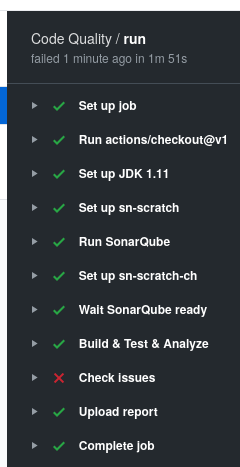
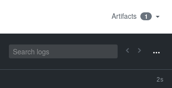
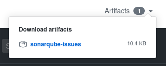
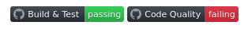

# Code Quality workflow

The workflow needs multiple steps (About 11), here theses steps :

The workflow run on [Ubuntu Linux](https://ubuntu.com). By default many tools and softs are installed,
and it is easy to set up other platform like [Java](https://openjdk.java.net). To use *SONARSCRATCH*,
we installed *SONARSCRATCH* docker and *SONARSCRATCH* checker (the current tool). After these 2
installations, we can launch *SonarQube* and wait it to be ready. If this done, we started [maven](https://maven.apache.org/) command for testing and analysis. When this step completed, we launch our tool (*SONARSCRATCH* checker) to find any issue. If there are issues, the workflow job fails and a report are
attached as artifact :

This artifact can be downloaded (for later analysis) :

In [README](../../README.md) file, the badge for Code Quality shows failure :

