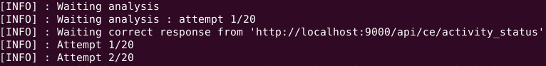
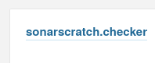
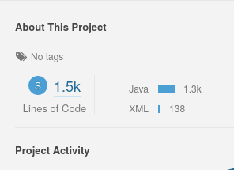
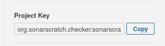
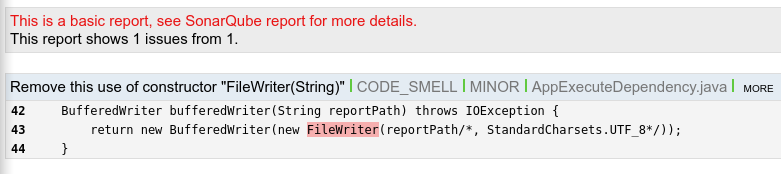

# How SONARSCRATCH checker works

Before using this tool, it is recommended to understand, how run *SonarQube* analysis.
Every language (or development platform) has its own way of analysis integration. See this [link](https://docs.sonarqube.org/latest/analysis/overview) for more details.

Using *SONARSCRATCH* docker and after fixing all issues founded by *SonarQube* , you want set up a
continuous integration for your project. So you decide in the part of your integration flow to
check if there are an issues reported by your custom configuration *SonarQube*. To do this
you must install this tool and execute this command :

```bash
sn-scratch-ch
```

The console output shows this :



As you see, *SONARSCRATCH* checker attempts to check the current activity of *SonarQube*. If your
instance is not yet running, the program will exit with error (code `1`). By default the tool check
the number of issues, if you want a report you must add `-r` option like this :

```bash
sn-scratch-ch -r
```

The generated report uses your source code to make previews, you must add the root path using
the option `--project` like this :

```bash
sn-scratch-ch -r --project:key "path/to/root/source"
```

where the **key** is the project key used by *SonarQube*. It is possible to see issues details using your browser (by default using the url **<http://localhost:9000>**). You can get the key from running *SonarQube* instance following theses steps :

1. Browse your *SonarQube* instance.
2. Click on your project

   

3. Go to the section **About this project**

   

4. At the bottom, you can find the project key

   

This is an example of report :



Because starting new *SonarQube* instance can take time, *SONARSCRATCH* checker can wait using
the option `-c`, you can set the time (in milliseconds) between two attemps (by default 20 attemps as maximum),
like this (10 seconds) :

```bash
sn-scratch-ch -c --sleep 10000
```

So if we summarize, here are the steps of any integration using *SONARSCRATCH* :

1. Run *SonarQube* container using *SONARSCRATCH* docker.
2. Wait *SonarQube* instance to be ready using the option `-c` of *SONARSCRATCH* checker.
3. Start your analyse.
4. Check the result using *SONARSCRATCH* checker.

The [current repository](https://github.com/tcdorg/sonarscratch-checker) is a good example of use case. This repository
is hosted on [GitHub](https://github.com), and using *GitHub* workflows it was possible to set up a continuous
integration. In the [folder workflows](../../.github/workflows), we can find 2 workflows : one
for **Build and Tests** and another for **Code quality**. See this [document](Code-Quality.md) for more details.
